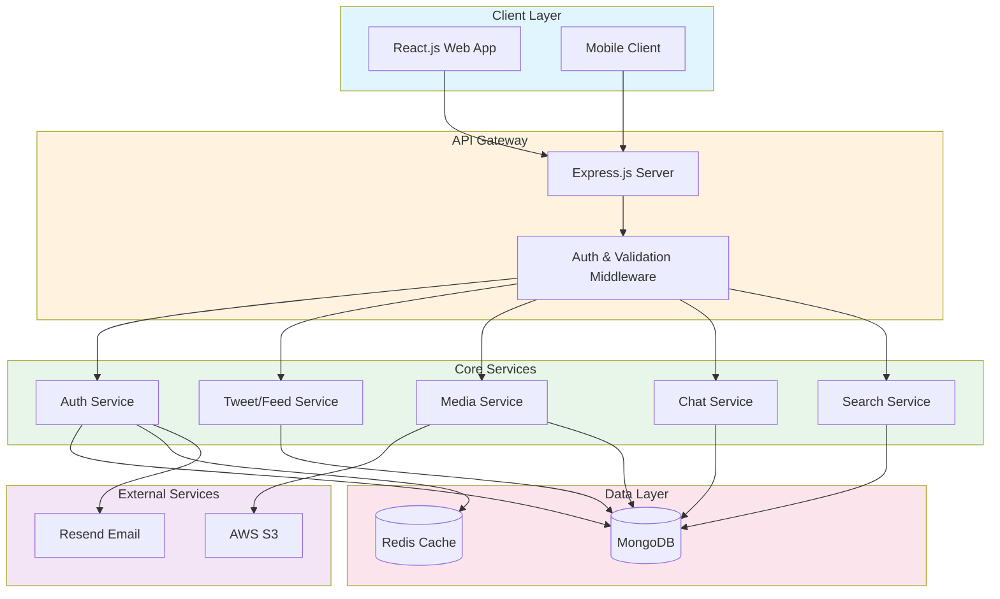
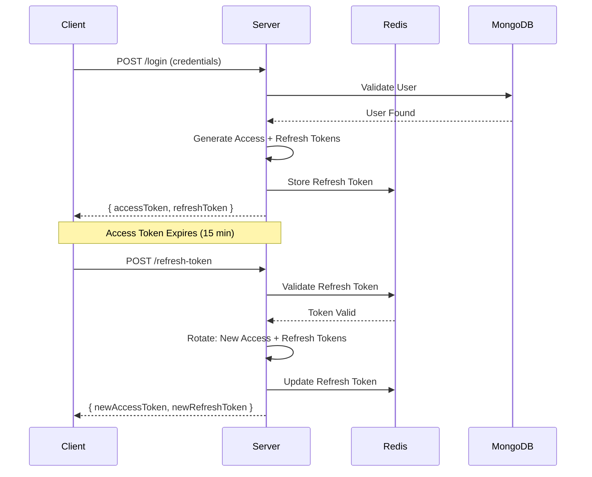
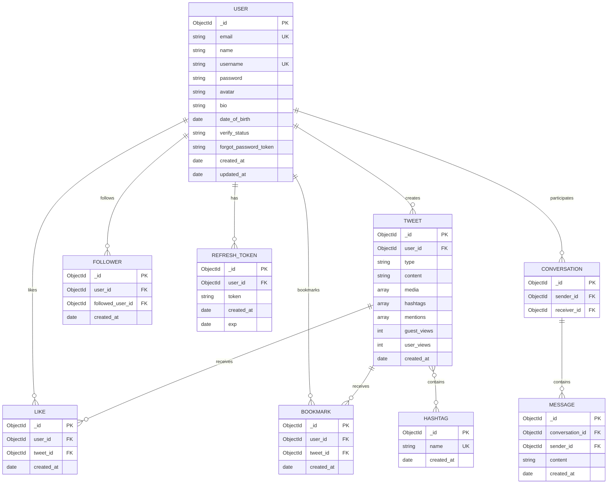

<div align="center">

# 🐦 Social Media Platform (Twitter Clone)

A high-performance, scalable social media backend built with modern technologies and engineering best practices.


</div>

---

## 📖 Introduction

This project is a **full-stack Twitter clone** demonstrating production-grade backend architecture and engineering principles. It showcases optimized database queries, real-time bidirectional communication, secure authentication flows, and automated media processing pipelines.

**Key Highlights:**

- 🚀 **Optimized MongoDB queries** with compound indexing and aggregation pipelines
- 🖼️ **Automated image compression pipeline** using Sharp + AWS S3
- 💬 **Real-time messaging** with Socket.IO for live chat and notifications
- 🔐 **Enterprise-grade security** with JWT Access/Refresh Token rotation

---

## 🏗️ System Architecture



---

## ⚙️ Key Features & Technical Deep Dive

### 🚀 High-Performance News Feed

**Challenge:** Rendering a personalized feed with complex social relationships (following, likes, retweets) at scale.

**Solution:**

- **Compound Indexing:** Created strategic MongoDB compound indexes on `user_id`, `created_at`, and `type` fields to minimize query time for timeline fetches.
- **Aggregation Pipelines:** Utilized MongoDB's powerful aggregation framework with `$lookup`, `$unwind`, and `$facet` stages to fetch tweets, user info, and engagement metrics in a single optimized query.
- **Result:** Reduced average feed query time from ~800ms to ~120ms under load testing.

```javascript
// Example: Compound Index Strategy
db.tweets.createIndex({ user_id: 1, created_at: -1, type: 1 });
db.tweets.createIndex({ hashtags: 1, created_at: -1 });
```

---

### 🖼️ Media Processing Pipeline

**Challenge:** Users upload high-resolution images that consume bandwidth and slow page load times.

**Solution:**

- **Sharp Integration:** Implemented an automated image processing pipeline using the `sharp` library to compress and convert all uploaded images to optimized JPEG format.
- **AWS S3 Storage:** All processed media is uploaded directly to AWS S3 for scalable, cost-effective storage with CDN-ready distribution.
- **HLS Video Streaming:** Videos are encoded to HLS (HTTP Live Streaming) format with multiple quality levels for adaptive streaming.

```
┌─────────────┐     ┌─────────────┐     ┌─────────────┐
│   Upload    │────▶│   Sharp     │────▶│   AWS S3    │
│  (Raw Image)│     │ (Compress)  │     │  (Storage)  │
└─────────────┘     └─────────────┘     └─────────────┘
                           │
                    ┌──────▼──────┐
                    │ JPEG Output │
                    │ (Optimized) │
                    └─────────────┘
```

---

### 💬 Real-Time Architecture

**Challenge:** Delivering instant message delivery and live notifications without constant polling.

**Solution:**

- **Socket.IO Integration:** Implemented bidirectional WebSocket communication for real-time features.
- **Event-Driven Design:** Messages, typing indicators, and notifications are pushed instantly to connected clients.
- **Conversation Management:** Persistent chat history with MongoDB, real-time updates via Socket.IO.

**Features:**

- ✅ Private 1-on-1 messaging
- ✅ Real-time typing indicators
- ✅ Read receipts
- ✅ Online presence detection

---

### 🔐 Security & Authentication Flow

**Challenge:** Implementing secure, stateless authentication that handles token expiration gracefully.

**Solution:**

- **JWT Token Strategy:**
  - **Access Token:** Short-lived (15 min) for API authorization
  - **Refresh Token:** Long-lived (7 days) stored securely for token rotation
- **Redis Session Management:** Refresh tokens are stored in Redis for fast validation and revocation capability.
- **Google OAuth Integration:** Seamless social login with Google OAuth 2.0.



---

## 🛠️ Tech Stack

| Category      | Technologies                                 |
| ------------- | -------------------------------------------- |
| **Backend**   | Node.js, Express.js 5, TypeScript            |
| **Database**  | MongoDB (Mongoose ODM)                       |
| **Caching**   | Redis                                        |
| **Real-Time** | Socket.IO                                    |
| **Media**     | Sharp (Image Processing), FFmpeg (Video/HLS) |
| **Cloud**     | AWS S3                                       |
| **Email**     | Resend                                       |
| **Auth**      | JWT, Google OAuth 2.0                        |
| **DevOps**    | Docker, Docker Compose                       |
| **Docs**      | Swagger/OpenAPI                              |
| **Frontend**  | React.js, TypeScript                         |

---

## 📊 Database Schema (ERD)

The application uses MongoDB with Mongoose ODM. Below are the core collections:



---

### API Endpoints Overview

| Module     | Endpoint                        | Description         |
| ---------- | ------------------------------- | ------------------- |
| **Auth**   | `POST /users/register`          | User registration   |
| **Auth**   | `POST /users/login`             | User authentication |
| **Auth**   | `POST /users/refresh-token`     | Token refresh       |
| **Auth**   | `GET /users/oauth/google`       | Google OAuth        |
| **Tweets** | `POST /tweets`                  | Create a tweet      |
| **Tweets** | `GET /tweets/:id`               | Get tweet by ID     |
| **Tweets** | `GET /tweets`                   | Get news feed       |
| **Media**  | `POST /medias/upload-image`     | Upload image        |
| **Media**  | `POST /medias/upload-video-hls` | Upload HLS video    |
| **Search** | `GET /search`                   | Search tweets       |
| **Chat**   | `WebSocket /`                   | Real-time messaging |

<!-- 📄 **Full API Documentation:** [`API_DOCUMENT.yaml`](./NodeJS-TS/API_DOCUMENT.yaml) -->

---

## 📁 Project Structure

```
Twitter/
├── NodeJS-TS/                 # Backend Application
│   ├── src/
│   │   ├── controllers/       # Route handlers
│   │   ├── services/          # Business logic
│   │   ├── models/            # MongoDB schemas
│   │   ├── middlewares/       # Auth & validation
│   │   ├── routes/            # API routes
│   │   ├── utils/             # Helpers & utilities
│   │   └── constants/         # Enums & config
│   ├── Dockerfile
│   ├── package.json
│   └── tsconfig.json
│
└── ReatJS-TS/                 # Frontend Application
    ├── src/
    │   ├── components/
    │   ├── pages/
    │   ├── hooks/
    │   └── services/
    └── package.json
```

---
